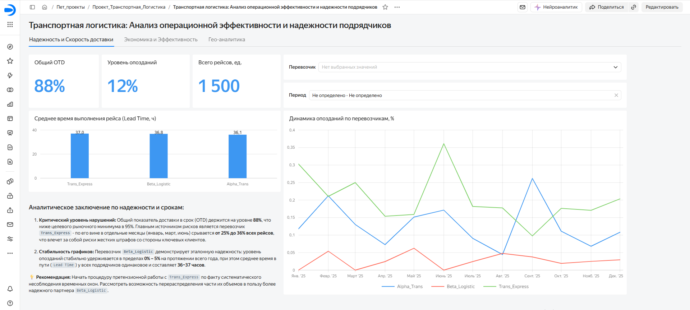
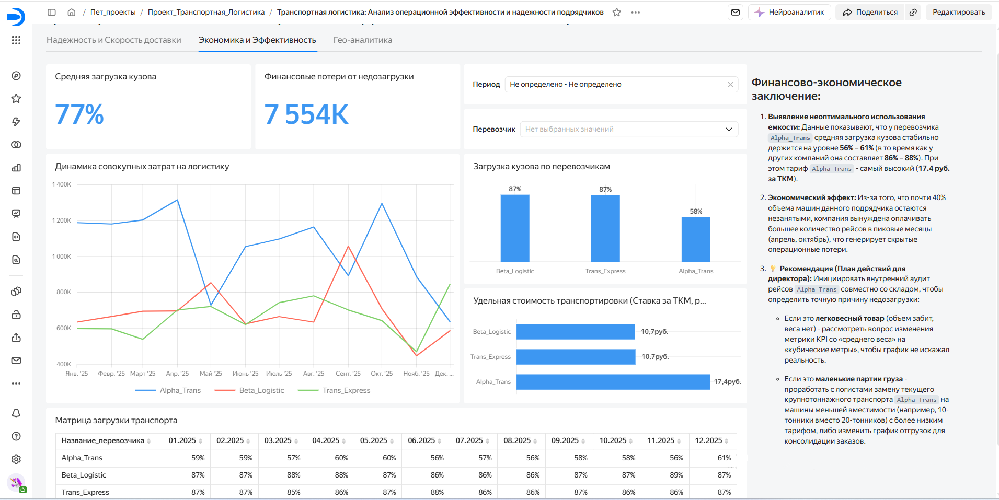
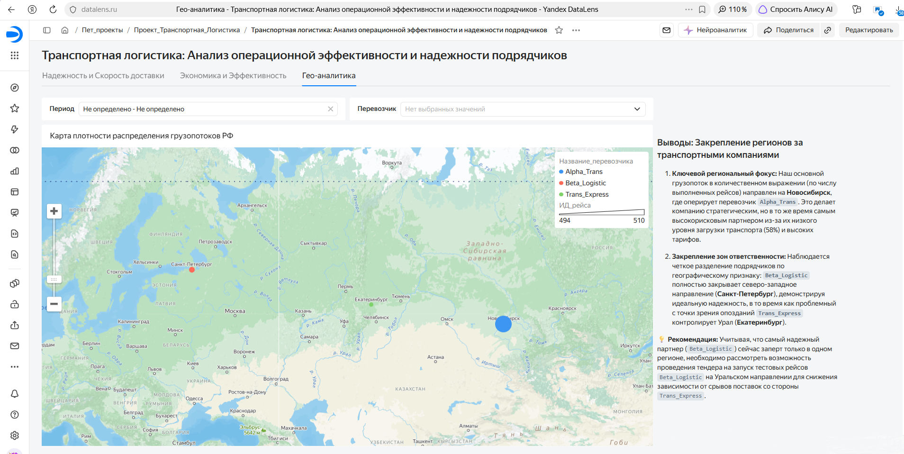

# 🚚 Сквозной BI-проект: Анализ операционной эффективности транспортной логистики и надежности подрядчиков (PostgreSQL & Yandex DataLens)

## 📌 Бизнес-контекст и проблематика
В компаниях с развитой сетью дистрибуции затраты на логистику составляют существенную долю в себестоимости продукции. Типичная проблема менеджмента — получение плоских Excel-отчетов от логистического отдела, где усредненные показатели (общий уровень доставки в срок 88%, средняя загрузка машин 77%) выглядят приемлемо, однако бизнес продолжает нести скрытые финансовые потери.

**Цель проекта:** Реализовать контролируемый переход от разрозненных таблиц к централизованной BI-системе. Декомпозировать верхнеуровневые показатели до конкретных подрядчиков, локализовать системные срывы сроков и оцифровать в рубли неэффективное использование объемов транспорта («перевозку воздуха»).

---

## 🛠️ Стек технологий и архитектура
* **СУБД:** PostgreSQL 15
* **Инструменты администрирования:** DBeaver
* **BI-платформа:** Yandex DataLens
* **Язык запросов:** SQL (LEFT JOIN, условные конструкции `CASE WHEN`, приведение типов, временные функции `EXTRACT(EPOCH)`)

---

## 🔄 Процесс ETL и создание аналитической витрины данных
Проект полностью симулирует интеграцию с ERP-системой 1С. Исходные транзакционные данные были импортированы из сырых системных таблиц со специфической технической кодировкой полей: 
* `_document120` - документ учета рейсов;
* `_document144` - данные складского веса;
* `_reference92` - справочник транспортных средств.

Для очистки, трансформации и расчета бизнес-метрик на уровне базы данных был разработан и выполнен специализированный SQL-скрипт, формирующий денормализованную витрину `витрина_перевозчики`.

📄 **[Посмотреть исходный SQL-скрипт создания витрины (create_carrier_datamart.sql)](sql/create_carrier_datamart.sql)**

### 💎 Ключевые инженерные решения в ETL-скрипте:
1. **Защита от деления на ноль (`NULLIF`):** При расчете стоимости тонно-километра (ТКМ) внедрена конструкция `NULLIF`, превращающая 0 в `NULL`. Это защищает витрину от срывов при вычислении рейсов с незаполненным весом или нулевым расстоянием.
2. **Расчет временных интервалов (Lead Time):** Разница между фактическим временем прибытия и выезда трансформирована в секунды с помощью `EXTRACT(EPOCH FROM...)` и переведена в операционные часы для корректного аналитического подсчета.
3. **Бизнес-логика дисциплины доставки:** С помощью `CASE WHEN` реализован бинарный флаг срыва тайм-слота (1 - опоздание, 0 - вовремя).
4. **Явное приведение типов (Casting):** Применение операторов `::timestamp` и `::numeric` позволило привести специфические типы данных 1С к стандартам математических расчетов в BI.

---

## 📊 Подключение данных и настройка датасета в Yandex DataLens

Сформированная витрина данных подключена к **Yandex DataLens**. В редакторе датасета выполнена разметка типов данных, переведены измерения в показатели и настроена агрегация для ключевых бизнес-метрик:

* **OTD (% доставки в срок):** Расчет через выражение `1 - AVG(Fact_opozdaniya)`.
* **Загрузка кузова (%):** Настроена агрегация `AVG(Загрузка_кузова_процент)`.
* **Средний Lead Time:** Настроена агрегация `AVG(Время_в_пути_часов)`.

---

## 📈 Структура дашборда и бизнес-результаты

Аналитический дашборд разработан в Yandex DataLens и состоит из 3 интерактивных листов, охватывающих полный цикл транспортной логистики.

### 📍 Лист 1: Дисциплина поставок (OTD & Lead Time)
Автоматизирован контроль своевременности доставки (OTD) на пуле из 1500+ рейсов. 
* **Инсайт:** Выявлен региональный перевозчик (`Trans_Express`), который скрыто срывал до 36% рейсов в пиковые периоды, существенно повышая риски штрафов и срывов обязательств перед клиентами.

---

### 📍 Лист 2: Экономика и утилизация транспорта
Внедрена кастомная метрика финансового ущерба от недозагрузки транспорта, оцифровавшая «перевозку воздуха» в рубли.
* **Инсайт:** Обнаружена упущенная выгода объемом **7.55 млн рублей** и ценовая аномалия у самого дорогого подрядчика `Alpha_Trans` (машины ходили пустыми на 42% при максимальном тарифе 17.4 руб./ТКМ).

---

### 📍 Лист 3: Гео-аналитика и распределение грузопотоков
Настроен картографический модуль с функцией `GEOCODE` для наглядного контроля распределения грузопотоков по регионам РФ и зонам ответственности контрагентов.
* **Инсайт:** Визуализирована плотность рейсов по направлениям, что позволило выявить дисбаланс в распределении объемов между подрядчиками в ключевых регионах.

---

## 💡 Ключевые бизнес-рекомендации по итогам анализа
1. Инициировать претензионную работу с `Trans_Express` по факту систематического нарушения тайм-слотов.
2. Провести внутренний аудит рейсов `Alpha_Trans` совместно со складом для выявления причин недозагрузки (проверка весообъемных характеристик груза) или заменить крупнотоннажный транспорт на машины меньшей вместимости.
